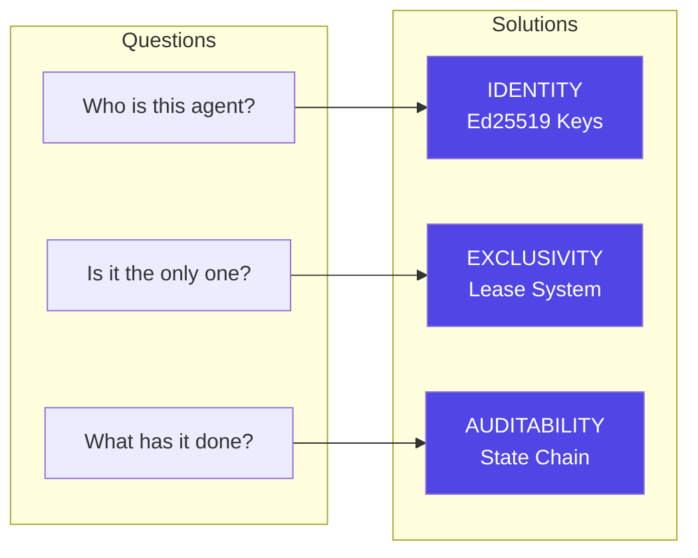
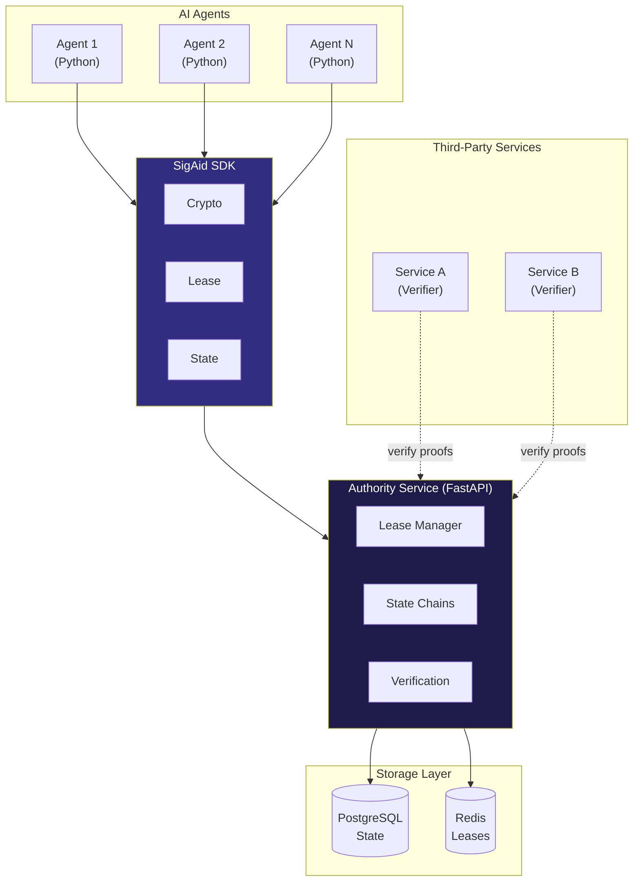
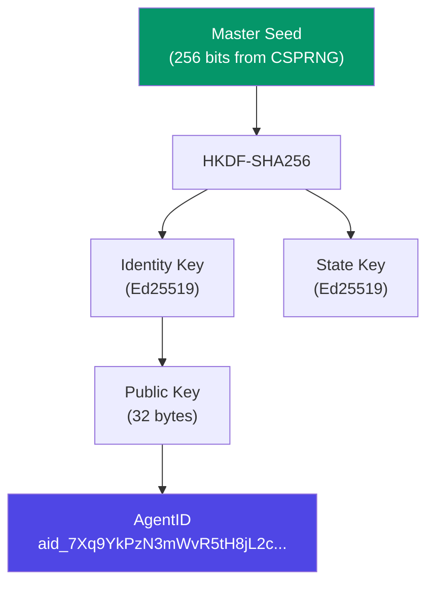
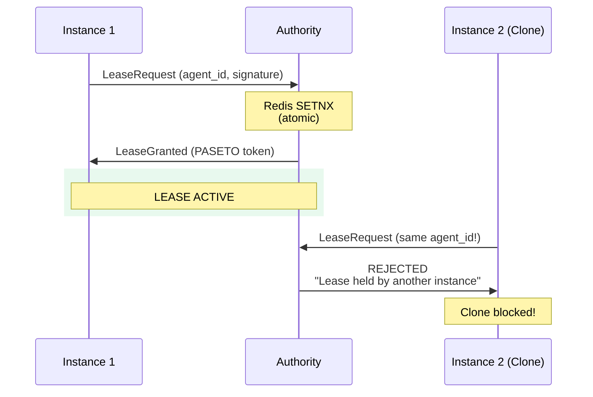
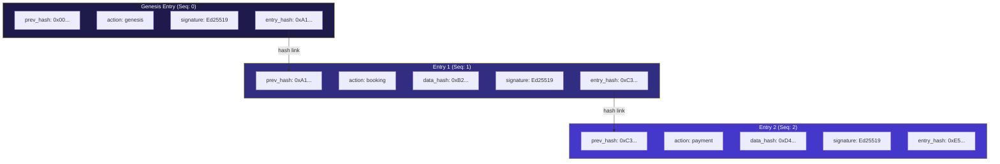
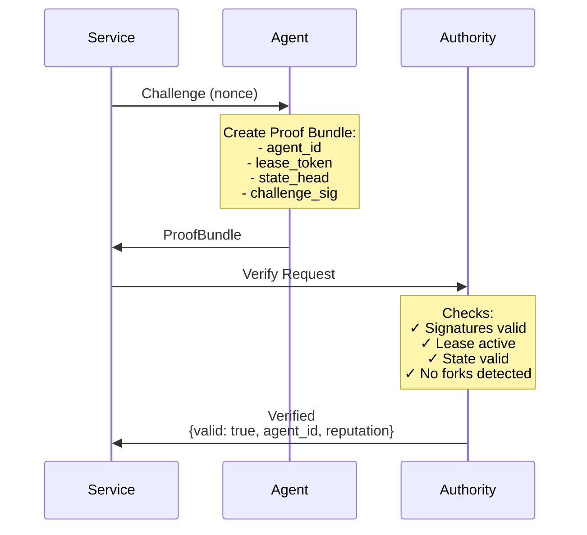
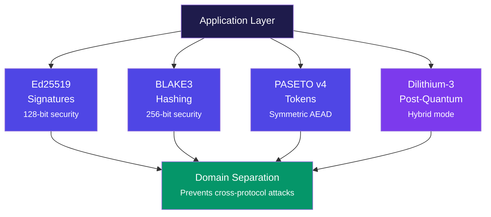
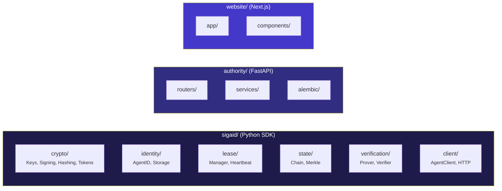

# SigAid

**Cryptographic Identity Protocol for AI Agents**

One identity. One instance. Complete audit trail.

[](./tests)
[](./pyproject.toml)
[](./LICENSE)

---

## What is SigAid?

SigAid is a cryptographic protocol that gives AI agents **verifiable identity**, **exclusive operation guarantees**, and **tamper-proof audit trails**. It solves the fundamental trust problem: *How do you know which agent you're dealing with, that it's the only one operating, and what it has done?*



---

## Architecture Overview



---

## How It Works

### 1. Agent Identity

Each agent has a unique cryptographic identity derived from an Ed25519 keypair:



```python
from sigaid import AgentClient

# Create agent with new identity
agent = AgentClient.create()
print(f"Agent ID: {agent.agent_id}")
# Output: aid_7Xq9YkPzN3mWvR5tH8jL2cBfA4dE6gS1
```

### 2. Exclusive Leasing

Only ONE instance of an agent can operate at any time. Clones are rejected:



```python
# Clone rejection in action
client1 = AgentClient.from_keypair(keypair)
client2 = AgentClient.from_keypair(keypair)  # Same keys = clone!

async with client1.lease():
    try:
        async with client2.lease():  # REJECTED!
            pass
    except LeaseHeldByAnotherInstance:
        print("Clone blocked!")
```

### 3. State Chain

Every action is cryptographically signed and hash-linked into a tamper-proof chain:



> **Any tampering breaks the chain! Fork detection catches inconsistencies.**

```python
async with agent.lease():
    # Record action - automatically signed and linked
    entry = await agent.record_action(
        action_type="transaction",
        data={"amount": 100, "recipient": "hotel_service"}
    )
    print(f"Sequence: {entry.sequence}")
    print(f"Hash: {entry.entry_hash.hex()[:16]}...")
```

### 4. Verification

Services verify agent identity with cryptographic proof bundles:



```python
from sigaid import Verifier

verifier = Verifier(api_key="your_key")

result = await verifier.verify(
    proof_bundle,
    require_lease=True,
    min_reputation_score=0.8
)

if result.valid:
    print(f"Verified: {result.agent_id}")
```

---

## Cryptographic Primitives



| Component | Algorithm | Purpose |
|-----------|-----------|---------|
| Identity Keys | **Ed25519** | Agent signatures (fast, 64-byte sigs) |
| Key Derivation | **HKDF-SHA256** | Derive keys from master seed |
| State Hashing | **BLAKE3** | Chain integrity (faster than SHA-256) |
| Lease Tokens | **PASETO v4.local** | Secure tokens (no algorithm confusion) |
| Post-Quantum | **Dilithium-3** | Future-proof hybrid signatures |

---

## Installation

```bash
pip install sigaid
```

Optional features:

```bash
pip install sigaid[pq]      # Post-quantum signatures
pip install sigaid[hsm]     # Hardware security modules
pip install sigaid[server]  # Self-hosted Authority
pip install sigaid[all]     # Everything
```

---

## Quick Start

```python
import asyncio
from sigaid import AgentClient

async def main():
    # Create agent with cryptographic identity
    agent = AgentClient.create()
    print(f"Agent: {agent.agent_id}")

    # Acquire exclusive lease
    async with agent.lease():
        # Record tamper-proof action
        await agent.record_action("booked_flight", {
            "flight": "UA123",
            "amount": 450.00
        })

        # Create verification proof
        proof = agent.create_proof(challenge=b"service_nonce")

    await agent.close()

asyncio.run(main())
```

---

## Project Structure



```
sigaid/
├── crypto/                  # Cryptographic primitives
│   ├── keys.py              # Ed25519 keypair management
│   ├── signing.py           # Domain-separated signatures
│   ├── hashing.py           # BLAKE3 hashing
│   ├── tokens.py            # PASETO lease tokens
│   ├── hybrid.py            # Post-quantum (Ed25519 + Dilithium)
│   └── hsm/                 # Hardware security module support
│
├── identity/                # Identity management
│   ├── agent_id.py          # AgentID format & validation
│   └── storage.py           # Encrypted keyfile storage
│
├── lease/                   # Exclusive leasing
│   ├── manager.py           # Lease acquisition & renewal
│   └── heartbeat.py         # Background auto-renewal
│
├── state/                   # State chain
│   ├── chain.py             # Append, verify, fork detection
│   └── merkle.py            # Merkle proofs for inclusion
│
├── verification/            # Proof system
│   ├── prover.py            # Create proof bundles
│   └── verifier.py          # Verify proofs (online/offline)
│
└── client/                  # SDK interface
    ├── agent.py             # Main AgentClient class
    └── http.py              # HTTP transport to Authority

authority/                   # Authority Service (FastAPI)
├── routers/                 # API endpoints
├── services/                # Business logic
└── main.py                  # Application entry

website/                     # Marketing & Docs (Next.js)
├── app/                     # Pages
└── components/              # UI components
```

---

## Running the Authority Service

### Docker (Recommended)

```bash
docker-compose up -d
curl http://localhost:8001/health
```

### Local Development

```bash
pip install -e ".[authority]"

export POSTGRES_HOST=localhost
export POSTGRES_DB=sigaid
export REDIS_URL=redis://localhost:6379

cd authority && alembic upgrade head
uvicorn authority.main:app --port 8001
```

### API Endpoints

| Method | Endpoint | Description |
|--------|----------|-------------|
| `POST` | `/v1/agents` | Register agent |
| `GET` | `/v1/agents/{id}` | Get agent info |
| `POST` | `/v1/leases` | Acquire lease |
| `PUT` | `/v1/leases/{id}` | Renew lease |
| `DELETE` | `/v1/leases/{id}` | Release lease |
| `POST` | `/v1/state/{id}` | Append state |
| `GET` | `/v1/state/{id}` | Get state head |
| `POST` | `/v1/verify` | Verify proof |

---

## Running Tests

```bash
pip install -e ".[dev]"
pytest tests/ -v --cov=sigaid
```

---

## Security Features

| Feature | Description |
|---------|-------------|
| **Domain-separated signatures** | Prevents cross-protocol attacks |
| **Constant-time operations** | Resistant to timing attacks |
| **Encrypted keyfiles** | scrypt + ChaCha20-Poly1305 |
| **HSM support** | Keys never leave hardware |
| **Post-quantum ready** | Hybrid Ed25519 + Dilithium-3 |
| **Fork detection** | Catches state chain tampering |

---

## Use Cases

| Use Case | How SigAid Helps |
|----------|------------------|
| **Financial Agents** | Audit trail for every transaction |
| **Booking Systems** | Prevent double-booking with exclusive leases |
| **Multi-Agent Orchestration** | Verify which agent did what |
| **Autonomous Systems** | Guarantee single point of control |
| **Compliance** | Tamper-proof logs for regulators |

---

## License

MIT License - see [LICENSE](./LICENSE) for details.

---

## Links

- **Website**: https://sigaid.com
- **Documentation**: https://sigaid.com/docs
- **GitHub**: https://github.com/trustorno/sigaid
