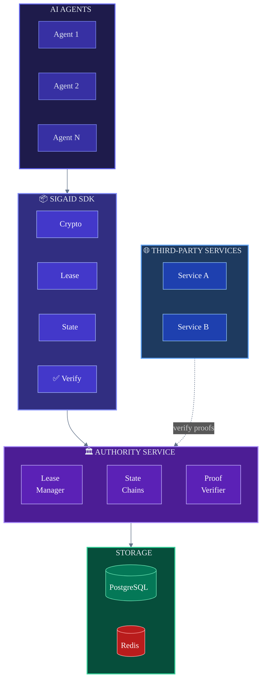
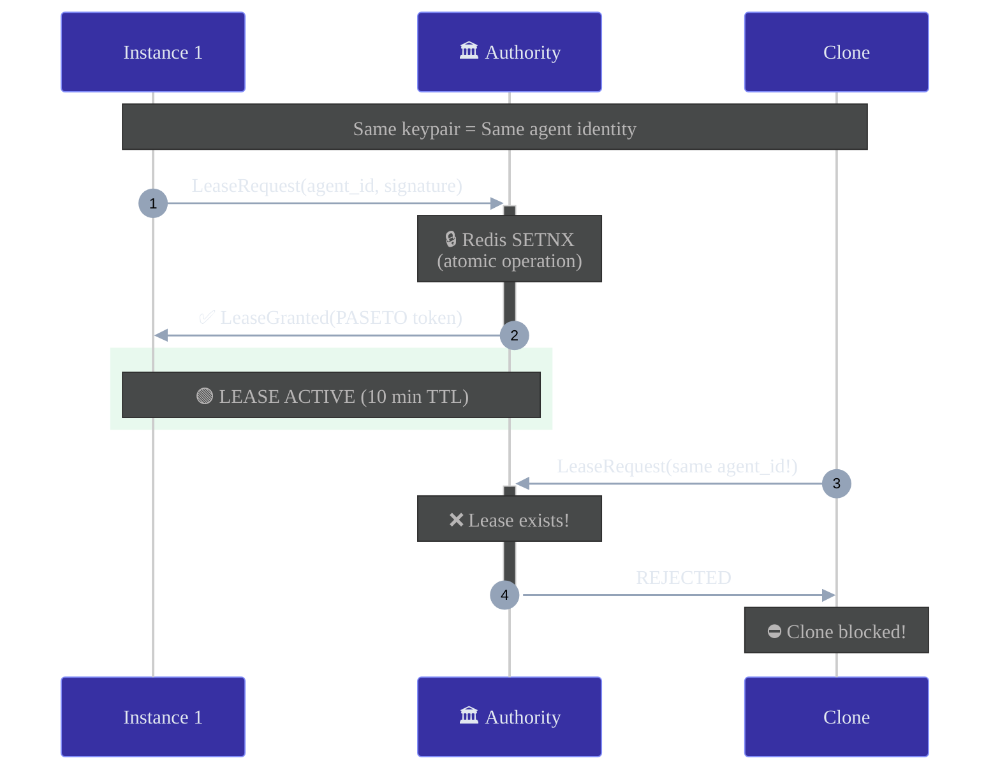
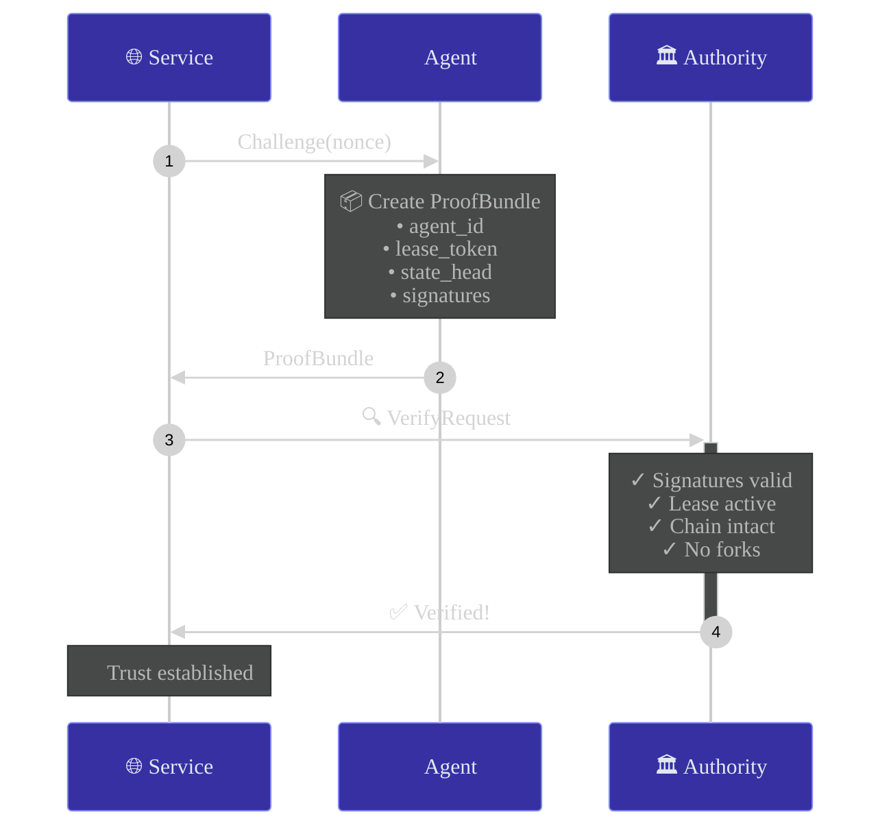
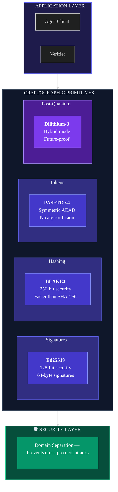

# SigAid

<div align="center">

**Cryptographic Identity Protocol for AI Agents**

*One identity. One instance. Complete audit trail.*

[](./tests)
[](./pyproject.toml)
[](./LICENSE)

[Website](https://sigaid.com) • [Documentation](https://sigaid.com/docs) • [Playground](https://sigaid.com/playground)

</div>

---

## The Problem

How do you trust an AI agent? Three fundamental questions:

```mermaid
%%{init: {'theme': 'dark', 'themeVariables': { 'primaryColor': '#6366f1', 'primaryTextColor': '#fff', 'primaryBorderColor': '#818cf8', 'lineColor': '#94a3b8', 'secondaryColor': '#1e1b4b', 'tertiaryColor': '#312e81', 'background': '#0f0f23', 'mainBkg': '#1e1b4b', 'secondBkg': '#312e81', 'fontFamily': 'ui-monospace, monospace'}}}%%
flowchart LR
    subgraph Q[" "]
        direction TB
        Q1["🤔 <b>Who is this agent?</b>"]
        Q2["🔒 <b>Is it the only instance?</b>"]
        Q3["📋 <b>What has it done?</b>"]
    end

    subgraph A[" "]
        direction TB
        A1["🔑 <b>IDENTITY</b><br/>Ed25519 Cryptographic Keys"]
        A2["⚡ <b>EXCLUSIVITY</b><br/>Atomic Lease System"]
        A3["🔗 <b>AUDITABILITY</b><br/>Hash-Linked State Chain"]
    end

    Q1 -.->|solved by| A1
    Q2 -.->|solved by| A2
    Q3 -.->|solved by| A3

    style Q fill:#0f172a,stroke:#334155,stroke-width:0px
    style A fill:#0f172a,stroke:#334155,stroke-width:0px
    style Q1 fill:#1e1b4b,stroke:#6366f1,stroke-width:2px,color:#e2e8f0
    style Q2 fill:#1e1b4b,stroke:#6366f1,stroke-width:2px,color:#e2e8f0
    style Q3 fill:#1e1b4b,stroke:#6366f1,stroke-width:2px,color:#e2e8f0
    style A1 fill:#059669,stroke:#34d399,stroke-width:2px,color:#fff
    style A2 fill:#059669,stroke:#34d399,stroke-width:2px,color:#fff
    style A3 fill:#059669,stroke:#34d399,stroke-width:2px,color:#fff
```



---

## Architecture



---

## How It Works

### 1️⃣ Agent Identity

Each agent has a unique cryptographic identity derived from an Ed25519 keypair:

```mermaid
%%{init: {'theme': 'dark', 'themeVariables': { 'fontFamily': 'ui-monospace, monospace'}}}%%
flowchart TB
    SEED["🌱 <b>Master Seed</b><br/><code>256 bits from CSPRNG</code>"]

    SEED --> HKDF

    subgraph HKDF["🔄 HKDF-SHA256 Key Derivation"]
        direction LR
        H1[" "]
    end

    HKDF --> IK & SK

    IK["🔑 <b>Identity Key</b><br/><code>Ed25519 Private</code>"]
    SK["🔏 <b>State Key</b><br/><code>Ed25519 Private</code>"]

    IK --> PK["📤 <b>Public Key</b><br/><code>32 bytes</code>"]
    PK --> AID["🆔 <b>AgentID</b><br/><code>aid_7Xq9YkPzN3mW...</code>"]

    style SEED fill:#059669,stroke:#34d399,stroke-width:2px,color:#fff
    style HKDF fill:#1e1b4b,stroke:#6366f1,stroke-width:2px,color:#e2e8f0
    style H1 fill:#1e1b4b,stroke:#1e1b4b
    style IK fill:#4338ca,stroke:#818cf8,stroke-width:2px,color:#fff
    style SK fill:#4338ca,stroke:#818cf8,stroke-width:2px,color:#fff
    style PK fill:#6366f1,stroke:#a5b4fc,stroke-width:2px,color:#fff
    style AID fill:#7c3aed,stroke:#c4b5fd,stroke-width:3px,color:#fff
```



```python
from sigaid import AgentClient

agent = AgentClient.create()
print(agent.agent_id)  # aid_7Xq9YkPzN3mWvR5tH8jL2cBfA4dE6gS1
```

---

### 2️⃣ Exclusive Leasing

Only **ONE** instance can operate at any time. Clones are cryptographically rejected:



```python
client1 = AgentClient.from_keypair(keypair)
client2 = AgentClient.from_keypair(keypair)  # Clone!

async with client1.lease():
    async with client2.lease():  # 💥 LeaseHeldByAnotherInstance
        pass
```

---

### 3️⃣ State Chain

Every action is cryptographically signed and hash-linked — tamper-proof by design:

```mermaid
%%{init: {'theme': 'dark', 'themeVariables': { 'fontFamily': 'ui-monospace, monospace'}}}%%
flowchart LR
    subgraph G["🌱 GENESIS"]
        G0["seq: 0"]
        G1["prev: <code>0x0000...</code>"]
        G2["action: <code>create</code>"]
        G3["sig: <code>Ed25519</code>"]
        G4["hash: <code>0xA1B2...</code>"]
    end

    subgraph E1["📝 ENTRY 1"]
        E1_0["seq: 1"]
        E1_1["prev: <code>0xA1B2...</code>"]
        E1_2["action: <code>booking</code>"]
        E1_3["sig: <code>Ed25519</code>"]
        E1_4["hash: <code>0xC3D4...</code>"]
    end

    subgraph E2["📝 ENTRY 2"]
        E2_0["seq: 2"]
        E2_1["prev: <code>0xC3D4...</code>"]
        E2_2["action: <code>payment</code>"]
        E2_3["sig: <code>Ed25519</code>"]
        E2_4["hash: <code>0xE5F6...</code>"]
    end

    G -->|"🔗"| E1 -->|"🔗"| E2

    style G fill:#059669,stroke:#34d399,stroke-width:2px,color:#fff
    style E1 fill:#4338ca,stroke:#818cf8,stroke-width:2px,color:#fff
    style E2 fill:#6366f1,stroke:#a5b4fc,stroke-width:2px,color:#fff
```



> ⚠️ **Tamper one entry → Break the entire chain. Fork detection catches inconsistencies.**

```python
async with agent.lease():
    entry = await agent.record_action("transaction", {"amount": 100})
    print(f"Sequence: {entry.sequence}, Hash: {entry.entry_hash.hex()[:16]}...")
```

---

### 4️⃣ Verification

Services verify agents with cryptographic proof bundles:



```python
from sigaid import Verifier

verifier = Verifier(api_key="...")
result = await verifier.verify(proof_bundle, require_lease=True)

if result.valid:
    print(f"✅ Verified: {result.agent_id}")
```

---

## Cryptographic Stack



| Component | Algorithm | Why |
|-----------|-----------|-----|
| **Signatures** | Ed25519 | Fast, compact (64 bytes), battle-tested |
| **Key Derivation** | HKDF-SHA256 | RFC 5869 compliant, deterministic |
| **Hashing** | BLAKE3 | 4x faster than SHA-256, Merkle tree mode |
| **Tokens** | PASETO v4.local | No algorithm confusion vulnerabilities |
| **Post-Quantum** | Dilithium-3 | NIST PQC winner, hybrid with Ed25519 |

---

## Quick Start

```bash
pip install sigaid
```

```python
import asyncio
from sigaid import AgentClient

async def main():
    # Create agent with cryptographic identity
    agent = AgentClient.create()
    print(f"🤖 Agent: {agent.agent_id}")

    # Acquire exclusive lease
    async with agent.lease():
        # Record tamper-proof action
        await agent.record_action("booked_flight", {
            "flight": "UA123",
            "amount": 450.00
        })

        # Create verification proof
        proof = agent.create_proof(challenge=b"nonce")

    await agent.close()

asyncio.run(main())
```

---

## Installation Options

```bash
pip install sigaid           # Core SDK
pip install sigaid[pq]       # + Post-quantum signatures
pip install sigaid[hsm]      # + Hardware security modules
pip install sigaid[server]   # + Self-hosted Authority
pip install sigaid[all]      # Everything
```

---

## Project Structure

```
sigaid/
├── crypto/           # 🔐 Ed25519, BLAKE3, PASETO, Dilithium
├── identity/         # 🆔 AgentID generation & storage
├── lease/            # ⚡ Exclusive lease management
├── state/            # 🔗 Hash-linked state chain
├── verification/     # ✅ Proof creation & verification
└── client/           # 📦 AgentClient SDK interface

authority/            # 🏛️ FastAPI Authority Service
website/              # 🌐 Next.js Marketing & Docs
```

---

## API Reference

| Method | Endpoint | Description |
|:-------|:---------|:------------|
| `POST` | `/v1/agents` | Register new agent |
| `POST` | `/v1/leases` | Acquire exclusive lease |
| `PUT` | `/v1/leases/{id}` | Renew lease |
| `DELETE` | `/v1/leases/{id}` | Release lease |
| `POST` | `/v1/state/{id}` | Append to state chain |
| `GET` | `/v1/state/{id}` | Get current state head |
| `POST` | `/v1/verify` | Verify proof bundle |

---

## Security Features

| Feature | Protection |
|:--------|:-----------|
| 🔐 **Domain-separated signatures** | Prevents cross-protocol attacks |
| ⏱️ **Constant-time operations** | Resistant to timing attacks |
| 🔒 **Encrypted keyfiles** | scrypt + ChaCha20-Poly1305 |
| 🔑 **HSM support** | Keys never leave hardware |
| 🛡️ **Post-quantum ready** | Hybrid Ed25519 + Dilithium-3 |
| 🔍 **Fork detection** | Catches state chain tampering |

---

## Use Cases

| Use Case | How SigAid Helps |
|:---------|:-----------------|
| 💰 **Financial Agents** | Complete audit trail for every transaction |
| 🏨 **Booking Systems** | Prevent double-booking with exclusive leases |
| 🤖 **Multi-Agent Systems** | Cryptographically verify which agent did what |
| 🚗 **Autonomous Systems** | Guarantee single point of control |
| 📋 **Compliance** | Tamper-proof logs for regulators |

---

## Running Tests

```bash
pip install -e ".[dev]"
pytest tests/ -v --cov=sigaid

# 160 tests passing ✅
```

---

<div align="center">

## Links

[🌐 Website](https://sigaid.com) • [📚 Documentation](https://sigaid.com/docs) • [🎮 Playground](https://sigaid.com/playground) • [💻 GitHub](https://github.com/trustorno/sigaid)

---

**MIT License** — Built with 🔐 by the SigAid team

</div>
