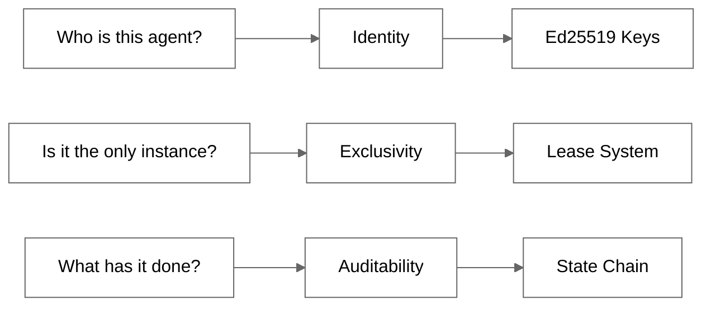
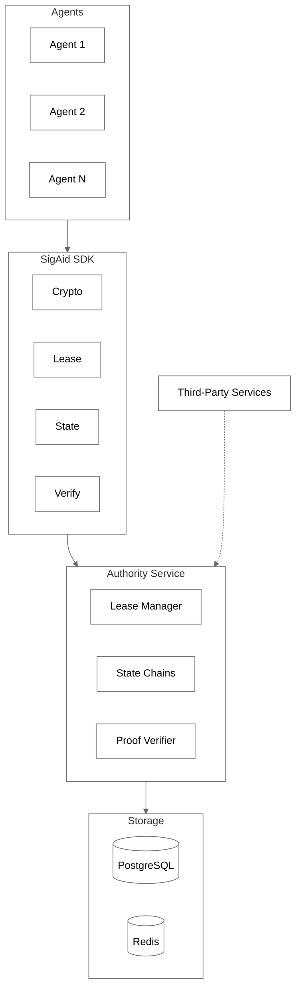
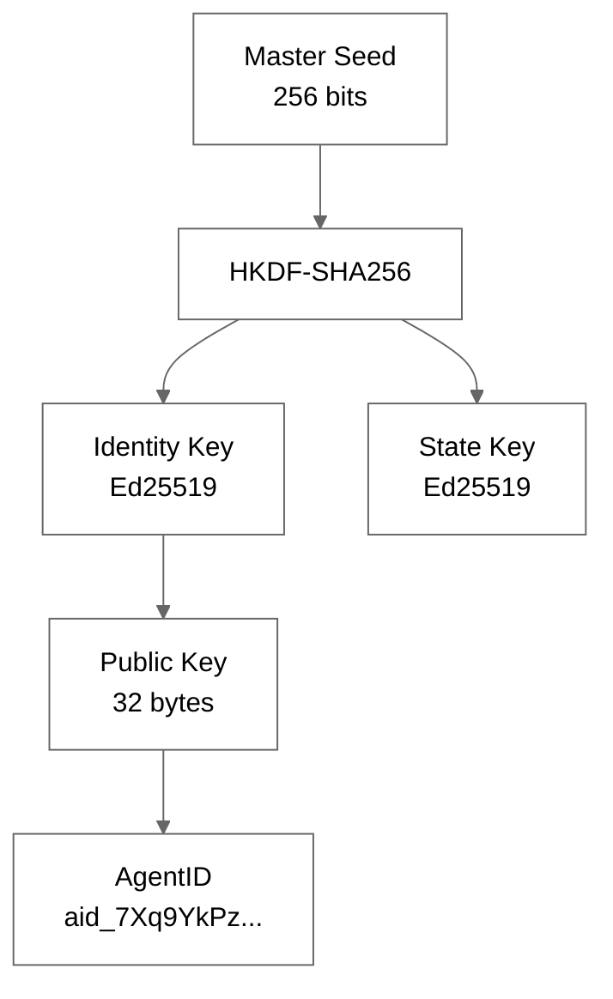
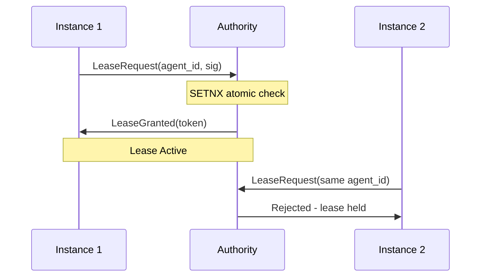
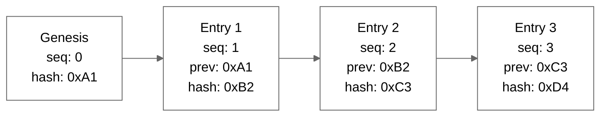
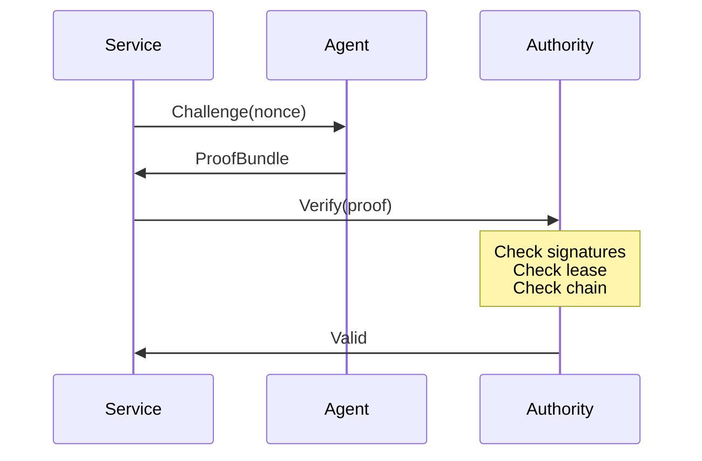
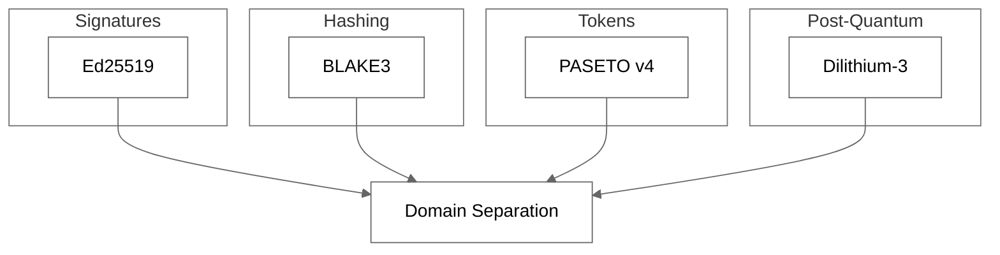

# SigAid

**Cryptographic Identity Protocol for AI Agents**

One identity. One instance. Complete audit trail.

[](./tests)
[](./pyproject.toml)
[](./LICENSE)

---

## The Problem



---

## Architecture



---

## Key Hierarchy



```python
from sigaid import AgentClient

agent = AgentClient.create()
print(agent.agent_id)  # aid_7Xq9YkPzN3mWvR5tH8jL2cBfA4dE6gS1
```

---

## Exclusive Leasing

Only one instance can operate at a time. Clones are rejected.



```python
async with client1.lease():
    async with client2.lease():  # Raises LeaseHeldByAnotherInstance
        pass
```

---

## State Chain

Every action is signed and hash-linked.



Tamper with any entry and the chain breaks. Fork detection catches inconsistencies.

```python
async with agent.lease():
    entry = await agent.record_action("payment", {"amount": 100})
```

---

## Verification



```python
result = await verifier.verify(proof_bundle)
if result.valid:
    print(f"Verified: {result.agent_id}")
```

---

## Cryptographic Stack



| Component | Algorithm | Purpose |
|-----------|-----------|---------|
| Signatures | Ed25519 | Fast, 64-byte signatures |
| Hashing | BLAKE3 | Faster than SHA-256 |
| Tokens | PASETO v4 | No algorithm confusion |
| Post-Quantum | Dilithium-3 | Future-proof hybrid |

---

## Quick Start

```bash
pip install sigaid
```

```python
import asyncio
from sigaid import AgentClient

async def main():
    agent = AgentClient.create()

    async with agent.lease():
        await agent.record_action("booked_flight", {
            "flight": "UA123",
            "amount": 450.00
        })
        proof = agent.create_proof(challenge=b"nonce")

asyncio.run(main())
```

---

## Installation

```bash
pip install sigaid           # Core SDK
pip install sigaid[pq]       # Post-quantum signatures
pip install sigaid[hsm]      # Hardware security modules
pip install sigaid[server]   # Self-hosted Authority
pip install sigaid[all]      # Everything
```

---

## Project Structure

```
sigaid/
├── crypto/          # Ed25519, BLAKE3, PASETO, Dilithium
├── identity/        # AgentID generation & storage
├── lease/           # Exclusive lease management
├── state/           # Hash-linked state chain
├── verification/    # Proof creation & verification
└── client/          # AgentClient interface

authority/           # FastAPI service
website/             # Next.js docs
```

---

## API

| Method | Endpoint | Description |
|--------|----------|-------------|
| POST | /v1/agents | Register agent |
| POST | /v1/leases | Acquire lease |
| PUT | /v1/leases/{id} | Renew lease |
| DELETE | /v1/leases/{id} | Release lease |
| POST | /v1/state/{id} | Append state |
| GET | /v1/state/{id} | Get state head |
| POST | /v1/verify | Verify proof |

---

## Links

- Website: https://sigaid.com
- Documentation: https://sigaid.com/docs
- GitHub: https://github.com/trustorno/sigaid

MIT License
